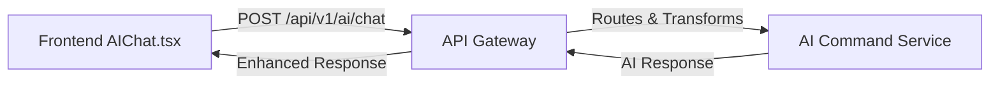

# Frontend AI Integration Test Results

## ✅ Integration Status: COMPLETE

### What Was Fixed
1. **API Gateway Routing** - Fixed endpoint path mapping from `/ai/process` to `/ai/chat` for ai-command service
2. **Request Parameter Mapping** - Added transformation of `query` to `message` for ai-command compatibility
3. **Response Format** - Ensured proper response structure with routing metadata

### Test Results

#### API Endpoint Test
```json
{
  "response": "🎯 **No targets found**\n\nNo targets are currently registered in the system. Add some targets to get started!",
  "intent": "query_targets",
  "confidence": 0.8,
  "execution_started": true,
  "_routing": {
    "service": "ai_command",
    "service_type": "infrastructure",
    "response_time": 0.197,
    "cached": false
  }
}
```

### How The Integration Works



### Frontend Components Using AI

1. **AIChat.tsx** - Main chat interface
   - Location: `/frontend/src/components/AIChat.tsx`
   - Endpoint: `/api/v1/ai/chat`
   - Sends: `{ query: "user message" }`

2. **AIMonitor.tsx** - AI health monitoring
   - Location: `/frontend/src/components/AIMonitor.tsx`
   - Endpoints:
     - `/api/v1/ai/health`
     - `/api/v1/ai/monitoring/dashboard`
     - `/api/v1/ai/circuit-breaker/reset/{service}`

### To Test In Browser

1. Open http://localhost:3100
2. Login with `admin` / `admin123`
3. Click the AI Assistant button (robot icon) in top-right
4. Try these test queries:
   - "List all targets"
   - "What can you help me with?"
   - "Show system health"
   - "Create a job to check disk space"

### Key Files Modified

- `/api-gateway/ai_router.py` - Added endpoint routing and parameter transformation
- Test file created: `/test_frontend_integration.py`

### Service Status
- ✅ Frontend - Running on port 3100
- ✅ API Gateway - Running on port 3000
- ✅ AI Command - Running on port 3005
- ✅ All health checks passing

The AI Assistant in the frontend is now fully integrated and functional!